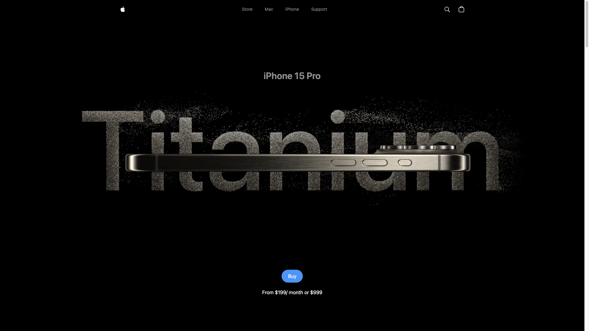
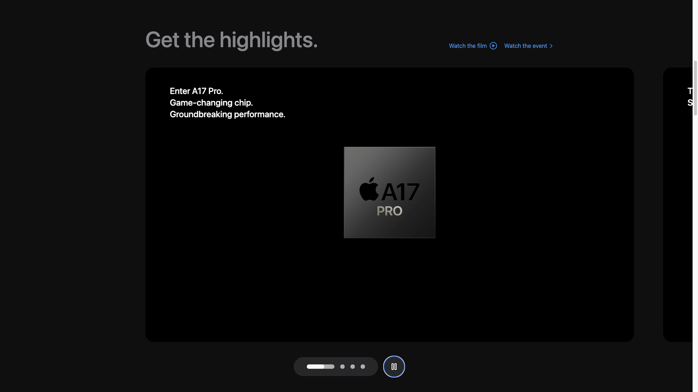
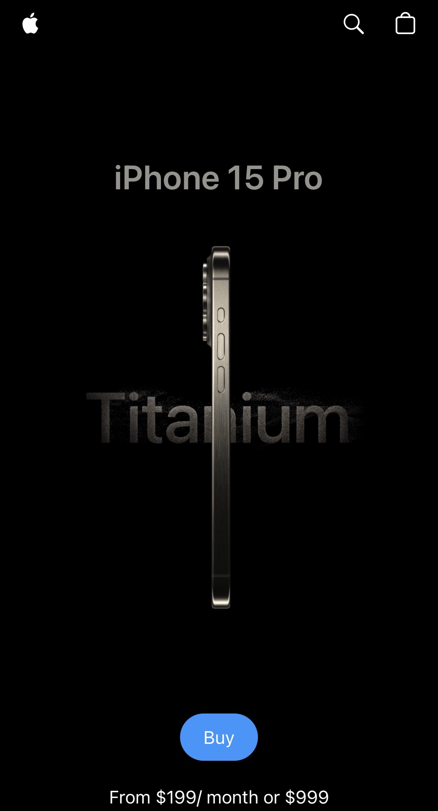
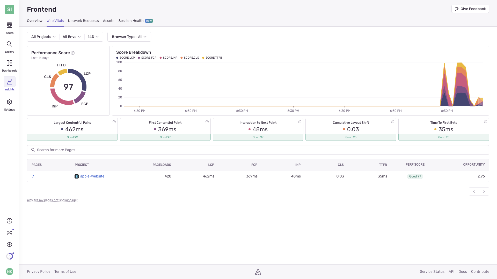

# 🍎 Apple iPhone Showcase Website

An elegant, animated Apple iPhone landing page built with **React**, **GSAP**, **Tailwind CSS**, and **Framer Motion**. It features responsive animations, video carousels, scroll-based transitions, and performance monitoring with **Sentry**.

## 🔥 Live Demo
[View Website on Vercel](https://apple-website-tan-mu.vercel.app/)

---

## 🚀 Features

- ⚡ **GSAP Scroll Animations** — Smooth reveal and parallax transitions.
- 🎞️ **Video Carousels** — Interactive highlight sections powered by GSAP.
- 📱 **Responsive Design** — Fully responsive for mobile, tablet, and desktop.
- 🎥 **Optimized Video** — Uses `playsInline`, `muted`, and `autoPlay` for seamless mobile playback.
- 📊 **Sentry Integration** — Real-time performance and error monitoring.
- 🔁 **Reusable Components** — Modular architecture for scalability.
- 🌓 **Dark UI Theme** — Inspired by Apple's official design aesthetics.

---

## 🛠️ Tech Stack

- **React 18**
- **GSAP (GreenSock Animation Platform)**
- **Tailwind CSS**
- **Sentry (Performance Monitoring & Error Logging)**
- **Vite** (or Create React App, depending on your setup)
- **Vercel** (for deployment)

---

## 📸 Screenshots

| Hero Section | Video Carousel | Mobile View |
|--------------|----------------|-------------|
|  |  |  |

---
## 📊 Performance Monitoring with Sentry

This project uses **Sentry** to track web vitals and performance metrics. Below are real-time insights from the production build.

### ✅ Web Vitals Summary

| Metric                          | Value   | Status     |
|--------------------------------|---------|------------|
| **Largest Contentful Paint**   | 462ms   | Good (99)  |
| **First Contentful Paint**     | 369ms   | Good (97)  |
| **Interaction to Next Paint**  | 48ms    | Good (97)  |
| **Cumulative Layout Shift**    | 0.03    | Good (95)  |
| **Time to First Byte**         | 35ms    | Good (95)  |
| **Overall Perf Score**         | 97      | Excellent  |

### 📸 Screenshot (Sentry Dashboard)



> The dashboard shows that the website performs exceptionally well across all major performance indicators.

---

## 🧠 Getting Started

### 1. Clone the Repo
```bash
git clone https://github.com/Nityananda-Krishnamoorthy/AppleWebsite.git
cd AppleWebsite
```

### 2. Install Dependencies
```bash
npm install
```

### 3. Add `.env` File for Sentry
```env
VITE_SENTRY_DSN=https://<your-dsn>@sentry.io/<project-id>
```

> 💡 You can get your DSN from the Sentry project settings after creating one at [https://sentry.io](https://sentry.io)

### 4. Run the Project
```bash
npm run dev
```

---

## 📈 Sentry Setup

### Installation
```bash
npm install @sentry/react @sentry/tracing
```

### Initialization (inside `index.js` )
```js
import * as Sentry from "@sentry/react";
import { BrowserTracing } from "@sentry/tracing";

Sentry.init({
  dsn: import.meta.env.VITE_SENTRY_DSN,
  integrations: [new BrowserTracing()],
  tracesSampleRate: 1.0, // Adjust as needed
});
```

> Sentry will track performance, page transitions, and console errors.

---

## 🧩 Folder Structure

```
public/
├── assets/
├── models/
└── index.html
src/
├── components/
├── constants/
├── utils/
├── App.jsx
├── index.js
└── index.css
```

---

## 🧪 Performance Optimization Tips

- Used `playsInline`, `muted`, and `autoPlay` for mobile-friendly video playback.
- Used `ResizeObserver` or `window.innerWidth` to dynamically swap HD vs mobile videos.
- Used `useGSAP()` to isolate scroll-based animations and avoid re-renders.
- Lazy-loaded all components and media assets.
- Used `Sentry` to track TTFB, load bottlenecks, and animation jank.

---

## 🚀 Deployment

This project is optimized for deployment via [Vercel](https://vercel.com):

```bash
npm run build
vercel deploy
```

---

## 📄 License

MIT © 2025 [Nityanada](https://github.com/Nityananda-Krishnamoorthy/)

---

## 🙌 Credits

Inspired by Apple.com. This is a personal project and not affiliated with Apple Inc.

---